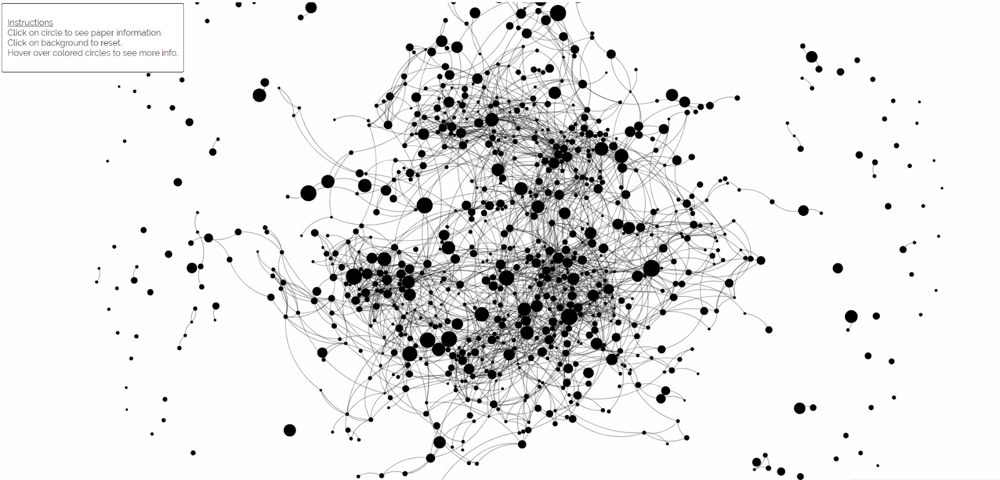
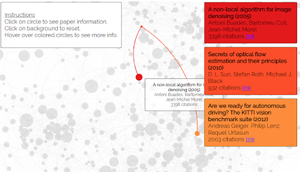
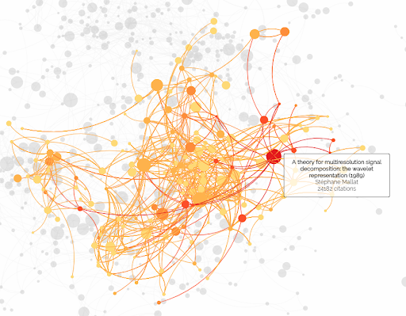
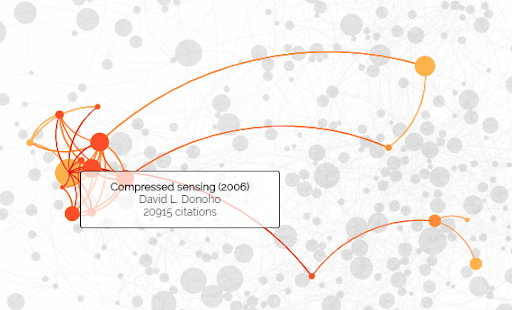
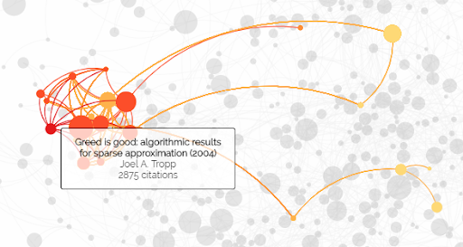
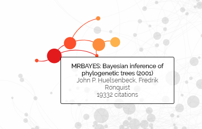

---
output:
  pdf_document:
    latex_engine: xelatex
mainfont: Arial
---

```{r setup, include=FALSE}
knitr::opts_chunk$set(echo = FALSE)
```

```{r, echo = FALSE, message=FALSE, warning=FALSE}
library(ggplot2)
library(tidyverse)
library(extracat)
library(tidyr)
library(dplyr)
library(lubridate)
library(vcd)
library(vcdExtra)
library(feather)
library(gridExtra)
library(reshape2)
library(ggpubr)
library(extracat)
```

# 1. Introduction

The main question that we are looking to answer in this project is what is the current trend in computer science and how it came to be. More specifically, we are interested in questions like what topic is popular in the past, what is popular in the present, and what is starting to gain popularity. We also want to know who are the influential people in these areas and how they are being influential.

## 1.1 Team Members

- Harin Sanghirun
- Thanaspakorn Niyomkarn

## Member Contributions

Harin is responsible for interactive visualization while Thanaspakorn is responsible the static visualization. The data acquisition, idea generation, and the report was written collaboratively.

# 2. Description of Data

## 2.1 Data Discovery

Originally, we have planned to scrape research paper data from arxiv.org using an readily available python package. However, upon inspection of the data, one very important piece is missing - the citation data. Without the citation data, we are not able to see the paper influence on other papers, and thus its importance.

In the end, we landed on the citation dataset from Open Academic Graph (OAG) which provides basic metadata like title, authors, and abstract on an academic paper, but most importantly the dataset also contains the number of citation that paper receives and the paper that it references. We have chosen the dataset from the DBLP which is a services that provide bibliographic information on computer science journal and proceedings. This allows us to have a dataset that is directly relevant to our question without having to filter through large amount of data. Even though the dataset is already scoped to computer science, it is still large by any standard, containing over 3 millions articles and 25 millions relationships.

## 2.2 Data Acquisition

OAG provides a download link that contain a line-separated JSON data. We then proceed to parse the data using python into pandas dataframe format which can be easily manipulate and clean.

There are over 3 millions research papers in the dataset which is too much for the purpose of exploratory data analysis and too large for local manipulation. Therefore, we have decided to pick the subset of data by selecting top 10 venues that contain the highest number of citation all time. The number of data is reduced to approximately 140,000 rows which is still large, but more practical.

## 2.3 Data Format

The dataset contains 8 columns with 4 text columns, 2 list columns, and 2 numeric columns. A detail description of each column was not given, as a result we have taken the liberty to interpret it using common sense and evidence. The following is our best effort interpretation of each column:

1. id - a unique identifier for the article <string>
2. title - the article’s title <string>
3. abstract - a summary of the article <string>
4. authors - a list of author <list of string>
5. venues - the publication venue string
6. references - a list of article id that this articles references <list of id string>
7. n_citation - The number of citation this article receives <numeric>

At first we debated whether this column means the number of citation this paper receives or how many articles this paper references. To answer this, we count the back link it receives from the references list of other articles and found that it is always less than or equal to n_citation. Since this dataset would probably not contain all the paper that is citing another paper, we conclude that it is the former.

8. year - The publication year <numeric>

```{r, warning=FALSE}
c_path <- "citation_only.feather"
citation_only <- read_feather(c_path)
```

```{r, warning=FALSE}
path <- "ml_papers_2.feather"
papers <- read_feather(path)
```

# 3. Analysis of Data Quality

## 3.1 Python preprocessing

The raw data downloaded from the source is in line-separated JSON format. We first read the data, convert it into a data frame format, and perform data cleaning using python. From 8 columns, we remove the *abstract* column out because the column contains very long string which consumes large memiry and is difficult to interpret and visualize. There are two columns that contain numeric values, **n_citation** and **year**. The **authors** and **references** column contain lists of string values which we convert to string in comma-separated format. The remaining three columns, **id**, **title** and **venue**, has string type values.

As mentioned earlier, we then subset data by selecting the papers from 10 venues with the highest citations for further analysis.

From the subsetted data, we decide to generate the 8th column named **topic** using Latent Dirichlet Allocation (LDA) [<http://www.jmlr.org/papers/volume3/blei03a/blei03a.pdf>] with titles of papers to cluster them into 5 topics. The reason is that we actually found a dataset with labeled fields of study, but it does not contain the information about citations that we need. By systematically generating the topics from our data, we are not only able to find a more interesting pattern in our data, but also create a sample guideline on visualizing similar research paper datasets.

The output file is in feather [<https://github.com/wesm/feather>] format which can be processed interchangeably between R and python.

## 3.2 Missing values

The original data contains some missing values in 'reference' column for approximately 17.28% which is the only missing value pattern found in the dataset. We assume that the NaN value results from the fact that the paper has no reference and handle it by replacing with an empty string.

## 3.3 *id* column

**id** is a string column containing unique identity for each research paper.
We have to be certain that each id is unique.

```{r, echo = TRUE, message=FALSE, warning=FALSE}
sum(duplicated(papers$id))
```

The **id** column is not duplicated. We can safely use it to count and join data in further analysis.

## 3.4 *authors* column

The **authors** column contains a string with a comma-separated format.  For example, *Gareth Beale, Graeme Earl*. We need to convert it into multiple lines, each of which contains a single author name and the other columns remain the same.

```{r, echo = TRUE, message=FALSE, warning=FALSE}
papers_authors <- papers %>% 
    mutate(authors = strsplit(authors, ",")) %>% 
    unnest(authors)

ggplot(count(papers_authors, authors), aes(x = n)) +
  geom_bar() +
  coord_cartesian(xlim = c(0,50)) +
  ylab("Frequency") +
  xlab("Number of Authors") +
  ggtitle("Histogram of Number of Authors per paper")
```

```{r, echo = TRUE, message=FALSE, warning=FALSE}
summary(count(papers_authors, authors)$n)
```
From the plot and summary, we found that the number of authors is very skewed. While more than 75% of authors have less than or equal to 2 papers, there are some authors that have published more than a hundred research papers in the 10 conferences.

The names of several authors, especially Chinese authors, are not their full or uniques name such as Wei Wang and Tomasi. As a result, when we aggregate the data, we usually find these names with unusually high frequency. This problem cannot be solved easily using just the current dataset. However, we do not see these names much in our analysis on subsetted data and after using average number instead of frequency.

## 3.5 *venue* column

**venue** is a categorical string column containing 10 unique values.
It is useful to know the distribution of papers among the venues.

```{r, echo = TRUE, message=FALSE, warning=FALSE}
ggplot(data=papers, aes(fct_rev(fct_infreq(venue)))) +
  geom_bar(stat="count") +
  coord_flip() +
  ylab("Number of Papers") +
  xlab("Venues") +
  ggtitle("Venues and Number of Papers") +
  theme(axis.text.y=element_text(size=rel(0.7)))
```

It appears that some of the venues have a significantly higher number of papers than the other especially Lecture Notes in Computer Science, International Conference on Acoustics, Speech, and Signal Processing, and International Conference on Robotics and Automation. When we analyze data using **venue** column, we need to be cautious and use statistics such as mean, median, or distribution to decrease the impact of different volumes between venues.


## 3.6 *n_citation* column

**n_citation** is a numerical column containing the number of citation of each paper

```{r, echo = TRUE, message=FALSE, warning=FALSE}
ggplot(data=papers, aes(n_citation)) +
  geom_bar(stat="count") +
  coord_cartesian(xlim = c(0,100)) +
  ylab("Frequency") +
  xlab("Citations") +
  ggtitle("Histogram of Citations per paper")
```

```{r, echo = TRUE, message=FALSE, warning=FALSE}
summary(papers$n_citation)
```

The number of citation is very skewed ranging from zero to 24,182 citations per paper with mean = 28.88 and median = 12. Moreover, we also found that the frequency of n_citation is unusually high and seems to often be capped at 50. Our assumption is that the data is topcoded at some point of collection process or 50 might be the number of some standards or qualifications of research papers. However, it is difficult to figure out what really happens or extrapolate the data, so we will leave it as it is.

## 3.7 *year* column

**year** is a numerical column containing the number of citation of each paper

```{r, echo = TRUE, message=FALSE, warning=FALSE}
ggplot(data=papers, aes(year)) +
  geom_bar(stat="count")+
  ylab("Number of Papers") +
  xlab("Year") +
  ggtitle("Number of Papers over Time")
count_by_year = papers %>% filter(year <2017) %>% group_by(year) %>% count()

count_by_year$pct = (count_by_year$n / lag(count_by_year$n) -1) * 100
ggplot(data=count_by_year, aes(x=year, y=pct)) +
    geom_bar(stat="identity") +
    ylab('Percent Change') +
    ylim(-100, 100) +
    ggtitle('Yearly Change in Paper Published') +
    theme_grey(14)
```

The number of papers increases drastically from 1960s to 2000s. However, it dropped sharply in 2007 and remain at roughly the same until 2016. It is also useful to note that the data is collected until 2017. Therefore, the number of papers in 2017 is very small because it is not collected completely at the time. We sometimes exclude the data from 2017 in some visualization.

## 3.8 *title* column

**title** is a discrete numerical column containing the year of publication of each paper

```{r, echo = TRUE, message=FALSE, warning=FALSE}
papers$title_length <- sapply(papers$title, 
                              function(x) length(unlist(strsplit(as.character(x), "\\W+"))))

ggplot(data=papers, aes(title_length)) +
  geom_bar(stat="count")+
  ylab("Frequency") +
  xlab("Title Length") +
  ggtitle("Frequency of Papers with certain Number of Title Length")
```

```{r, echo = TRUE, message=FALSE, warning=FALSE}
summary(papers$title_length)
```

The title length of papers is a right-skewed normal distribution with mean = 9.493. Since the title itself is a long text which is difficult to process, we decided to create a column named **title_length** to represent and utilize it further.

## 3.9 *references* column

The **references** column contains string with comma-separated format.  For example, *'8c78e4b0-632b-4293-b491-85b1976675e6', '9cdc54f0-f1a0-4422-ac16-d9164d9371ee'*. We need to convert it into mulitiple lines, each of which contains a single author name and the other columns remain the same.

```{r, echo = TRUE, message=FALSE, warning=FALSE}
papers_reference <- papers %>% 
    mutate(references = strsplit(references, ",")) %>% 
    unnest(references)

ggplot(count(papers_reference, references), aes(x = n)) +
  geom_bar() +
  coord_cartesian(xlim = c(0,50)) +
  ylab("Frequency") +
  xlab("Number of References") +
  ggtitle("Frequency of Papers with certain Number of References")
```

```{r, echo = TRUE, message=FALSE, warning=FALSE}
summary(count(papers_reference, references)$n)
```


The median of number of references is as low as 1 which makes us doubt the correctness of the data and decided to verify directly at the actual papers. We found that the number of references a paper references is not correct in the case that it is almost always lower than it should be. This might result from the fact that the referenced papers are not in this database, as a result no id can be assigned and included in the list of references. Again, there is no way to fix the problem using the given dataset.

 
## 3.10 *topic* column

**topic** is a categorical string column containing 6 unique values which we generate using the title column.

```{r, echo = TRUE, message=FALSE, warning=FALSE}
ggplot(data=papers, aes(fct_rev(fct_infreq(topic)))) +
  geom_bar(stat="count")+
  xlab("Topics") +
  ylab("Number of Papers") +
  ggtitle("Number of Papers from each Topic") +
  coord_flip() 
```

Each topic contains a similar number of research papers ranging from 25,000 to 31,000 papers.

\pagebreak


# 4. Main Analysis (Exploratory Data Analysis)

## 4.1 Citation over Time

```{r, echo = TRUE, message=FALSE, warning=FALSE}
citation_summary <- papers %>%
  group_by(year) %>%
  summarise_each(funs(mean, median), n_citation)

ggplot(melt(citation_summary, id.vars='year'), 
       aes(x=year, y=value, fill=variable)) +
  geom_bar(stat='identity', position='dodge') +
  ylab("Citations") +
  xlab("Year") +
  ggtitle("Mean and Median of Citations Over Time")
```

Since the number of papers in each year differs substantially. It is more suitable to compare the number of citations across year using mean as a summarized statistics along with median which allows us to see the middle value better in the case that the data is asymmetric. 
From the grouped bar chart, we observe that the avaerage number of citations reached its peak during 1955, 1975, and 1990, then it gradually decreases until present. The reason is likely to be that the researches published in the past have been cited longer than the more recent publications. Moreover, it might be the case that the papers from early years tend to be more fundamental which is more common to be cited than more applied papers published later. However, there is not sufficient data on the time of each citation and whether the research is fundamental or applied to verify these assumptions from this dataset.

The bars for median can capture the abnormality of the number of citations equal to 50 which makes the plot contain less valuable information about the middle value of citaions over years.


## 4.2 Citation and Authors

```{r, echo = TRUE, message=FALSE, warning=FALSE}
top_10_authors <- head(arrange(dplyr::summarise(group_by(papers_authors, authors),
                                                total_citation =sum(n_citation)),
                               desc(total_citation)), n=10)

papers_top_authors <- papers_authors %>% 
  filter(authors %in% top_10_authors$authors)

authors_citation <- dplyr::summarise(group_by(papers_top_authors, authors, year),
                                     yearly_citation =sum(n_citation))

cumsum_authors_citation <- authors_citation %>% 
  group_by(authors) %>% 
  mutate(cum_citations = cumsum(yearly_citation))

ggplot(cumsum_authors_citation, aes(year, cum_citations,colour=authors)) + 
  geom_line() +
  geom_point(size = 1) +
  ggtitle("Number of Citations of top Authors Over Time") +
  ylab("Cumulated Citations") +
  xlab("Year")
```

We are interested in how each authors, especially the top-cited authors all time, gain their citation over years. The cumulative frequency plot give two interesting patterns that while some popular authors accumulate the number of citations over a long period of time such as TJitendra Malik  who started to publish their works in these conferences before 1990 until they gain the number of citations up to 50,000 citations in 2017. However, the other pattern that we found is that some other authors gain their number of citations significantly over a short period of time, such as Rodrigo Lopez and Stephane Mallat who were cited over 20,000 times and became one of the most cited authors within only one of the years in their careers.


```{r, echo = TRUE, message=FALSE, warning=FALSE}
top_30_authors_mean <- head(arrange(dplyr::summarise(group_by(papers_authors, authors),
                                                     mean_citation =mean(n_citation)), 
                                    desc(mean_citation)), n=30)

ggplot(top_30_authors_mean, aes(x = mean_citation, y = reorder(authors, mean_citation))) +
  geom_point() + 
  ylab("Authors") +
  xlab("Average Citations") +
  coord_cartesian(xlim = c(0,21000))
```

After exploring the total number of citation. We found that some authors have been publishing their work longer the others which make us curious about the impact from each paper they produced. The Cleveland dot plot show the average number of citations of each paper the author published. We found that many of the authors in this plot does not appear in the all-time list, although their works are cited for over a 10,000 times on average. This can be caused by two reasons. The first one is that they are relatively new researchers who has published only a few works. For the second reasons, we need to refer back to the previous plot in the case of Stephane Mallat who appears in the plot for only a few years. Since this is the subsetted data of 10 venues, it is possible that they are famous authors but only submitted their works to these venues for only a few times

\pagebreak

## 4.3 Citation and Topic

```{r, echo = TRUE, message=FALSE, warning=FALSE}
topic_freq <- dplyr::summarise(group_by(papers, year, topic), frequency = n())

ggplot(topic_freq, aes(year, frequency,colour=topic)) + 
  geom_line() +
  ggtitle("Number of Papers from Each Topic over Time") +
  xlim(1954, 2016)
```

The number of papers in each topic has a similar general trend over the papers overall as discussed earlier that it reached its peak in 2006 , then falls drastically and remians about the same level until present. However, it is difficult to discuss the ranking and trend of topics from this frequency plot. Therefore, we create the percentage version of this graph and discuss it in the next plot.


```{r}
total_by_year <- papers %>% filter(year < 2017) %>% group_by(year) %>% count()
topic_pct <- papers %>% 
  filter(year < 2017) %>% 
  group_by(year, topic) %>% 
  count() %>% 
  mutate(pct = n*100 /total_by_year[total_by_year$year == year,]$n)

ggplot(topic_pct, aes(year, pct, colour=topic)) + 
  geom_line() +
  ggtitle("Percentage of Papers by Topic over time") +
  ylab('Percentage of All Papers By Year') +
  theme_grey(14)
```

By comparing by percentage, we can see the trend clearer that from 1960 to 1980, the papers on Signal and Speech Processing dominates in terms of the number of papers among all Computer Science publications. We can also see the Pattern Recognition and Machine Learning field gaining its volume share during the period. In the recent years, we can also see the trend in popularity of Machine Learning and Computer Vision field. However, Signal and Speech Processing which once had a lot of interest in the past is having the least contribution volume.

```{r, echo = TRUE, message=FALSE, warning=FALSE}
topic_percent_cite <- dplyr::summarise(group_by(papers, year, topic), 
                                       sum_citaition = sum(n_citation))
topic_percent_cite <-  group_by(topic_percent_cite, year) %>% 
  mutate(percent = sum_citaition*100/sum(sum_citaition))
ggplot(topic_percent_cite, aes(year, percent,colour=topic)) + 
  geom_line() +
  ggtitle("Percentage of Topic by Number of CItations Over Time") 
```

From the line plot, we can see that the popularity of papers (measured by the number of citations) has a similar pattern with the percentage of papers by topic, but with higher variance. This suggests an interesting relationship between number of papers and citations that when papers are published more in a field, the citations percentage usually grow accordingly.

```{r, echo = TRUE, message=FALSE, warning=FALSE}
ggplot(papers, aes(n_citation, fill = topic, colour = topic)) +
  geom_density(alpha = 0.1) +
  coord_cartesian(xlim = c(0,500))+
  ylab("Density") +
  xlab("Citations") +
  ggtitle("Density Plot of Citations among Topics")
```

The density plot of citations of each topic has very similar shape. Although it is very subtle, we can see that Computer Vision has the highest density at the higher number of citaions.

However, we believe that the density plot will give us more information about the distribution of citaions in each topic if it is not disturbed by the unusal peak at 50. 


## 4.4 Citation and Venue

```{r, echo = TRUE, message=FALSE, warning=FALSE}
venue_citation <-  papers%>%
  select(venue, n_citation)

citation_only$venue <- "All venues"

citation_only <- rbind(venue_citation, citation_only)
ggplot() + 
  geom_boxplot(data = citation_only, 
               aes(x = reorder(venue, n_citation, FUN = median), 
                   y = n_citation)) +
  coord_flip(ylim = c(0, 250))+
  ylab("Venunes") +
  xlab("Citations") +
  ggtitle("Boxplot of Venues and Citations") +
  theme(axis.text.y=element_text(size=rel(0.7)))
  
```

The boxplot shows us a vast difference in the distribution of citations among all venues. It is obvious that some venues seem to be more popular and get cited than the other. For example, the IEEE Transactions on Pattern Analysis and Machine Intelligence has the median of citations as high as 70, while the International Conference on Computer Graphics and Interactive Techniques has the median of fewer than 10 citations. Most of the conference have the median around 50 citations per research papers. We also include the boxplot of non-subsetted data (All venues) and find that our lists of most cited venues all time also have higher citations per paper than all the venues in general.

Note that the problem of n_citation = 50 is also captured by the boxplot of some, but not all, venues.

## 4.5 Citation and Title

As we tried to make use of the title column in our analysis. We found a research, "Papers with shorter titles get more citations"
[<https://www.nature.com/news/papers-with-shorter-titles-get-more-citations-1.18246>], which suggests an interesting relationship between title length and citations. We decide to use a scatter plot to see the relationship between the variables.


```{r, echo = TRUE, message=FALSE, warning=FALSE}
title_length_citation <- dplyr::summarise(group_by(papers, title_length),
                                          mean_citation =mean(n_citation))
title_length_citation$lower <- qpois(0.025, title_length_citation$mean_citation)
title_length_citation$upper <- qpois(0.975, title_length_citation$mean_citation)
ggplot(title_length_citation, aes(x=title_length, y=mean_citation)) +
   geom_point() +
   geom_errorbar(aes(ymin = lower, ymax = upper), width=.2)+
  ylab("Citations") +
  xlab("Title Length") +
  ggtitle("Average Citations and Title Length", subtitle=('Poisson 95% Confidence Interval')) +
  theme_grey(14)
```

The dot plot shows the relationship between average number of citations and title length. Since the distribution of citations resembles a Poisson distribution, we decide to include the 95% confidence interval of Poisson distribution to take into account the deviation. Although we cannot summarize statistically that the title length has a linear relationship with the citations, the plot still show an interesting trend that papers with shorter title length seem to have more citations than those with longer names.

# 5. Executive Summary

The goal of this report is to assess trend in computer science and how advancement is being gain -- is it through regular contribution from individuals or a leap that is caused by certain paper irregularly. To this end, we have decided the number of paper in each topic is representative of the level of attention it is getting, while the number of citation a paper gets is representative of the influence it has. Due to the large number of paper in the dataset, we have narrowed down the analysis to the papers from the top 10 publication venues by the total number of citation their papers received. This resulted in 140,000 papers.

As the first thing you see being reading any paper, the title is undoubtedly an important attribute. We have analyze the title length with the number of citations it received and have found that short paper receives more citation with significance. Note that this does not mean shorter paper will get more citation, it just means that shorter paper often have more citation.

```{r}
ggplot(title_length_citation, aes(x=title_length, y=mean_citation)) +
   geom_point() +
   geom_errorbar(aes(ymin = lower, ymax = upper), width=.2)+
  ylab("Citations") +
  xlab("Title Length") +
  ggtitle("Average Citations and Title Length", subtitle=('Poisson 95% Confidence Interval')) +
  theme_grey(14)
```

To assess the popularity of computer science, we looked at the number of paper published each year. While looking at the raw number, it seems like the period from 1995 to 2006 have the strongest trend. However, if we look at the percentage change per year, we can see that the two years with the strongest growth is 1959 and 1978. One notable observation is that after year 2006, the number of paper seems to drop to a steady state of around 5000 papers per year.

```{r}
ggplot(data=papers, aes(year)) +
  geom_bar(stat="count")+
  ylab("Number of Papers") +
  xlab("Year") +
  ggtitle("Number of Papers over Time") +
  theme_grey(14)

ggplot(data=count_by_year, aes(x=year, y=pct)) +
    geom_bar(stat="identity") +
    ylab('Percent Change') +
    ylim(-100, 100) +
    ggtitle('Yearly Change in Paper Published') +
    theme_grey(14)

```

To analyze popularity of computer science fields, we have grouped the papers into 5 different categories using Latent Dirichlet Allocation model to automatically categorize them based on their title. The resulting graph says the same story as the paper per year chart above. However, once we have normalized the number of paper each year into percentage of total paper in each year, we are able to see how each topic does compared to each other. While all topic is undoubtedly growing, we can see that Pattern Recognition and Machine Learning and Robotics and Automation is on the rise, on the other hand, Signal and Speech Processing is growing slower than others. This is consistent with everyday experience where all people talk about is Artificial Intelligence, a superset of the two growing fields.

```{r}
ggplot(topic_pct, aes(year, pct, colour=topic)) + 
  geom_line() +
  ggtitle("Percentage of Papers by Topic over time") +
  ylab('Percentage of All Papers By Year') +
  theme_grey(14)
```

Looking at the individual level of authors, we have found that most of the top contributing authors contributed regularly.

```{r}
ggplot(cumsum_authors_citation, aes(year, cum_citations,colour=authors)) + 
  geom_line() +
  geom_point(size = 1) +
  ggtitle("Number of Citations of top Authors Over Time") +
  ylab("Cumulated Citations") +
  xlab("Year")
```

In conclusion, we can see that the field of computer science is in its mature stage. However, the research interest in Artificial Intelligence is growing faster than other, while Signal and Speech processing seems to be falling behind in growth. Moreover, the progress in the field is made by continuous hard work by individual in the field.

# 5. Interactive Component

(The interactive component can be found at https://harrr.in/network.html)

## 5.1 Overview



The goal of the interactive component is to visual that impact that each paper has on other papers. Since citation between papers is a relationship which naturally translates to a graph, we have chosen to use a graph to visualize their relationship.

Even though we have already subsetted the original data to the 10 most popular venues, it is still too large to be visualize using D3. A web page with 140,000 DOM would cripple the browser. As a result, we have chosen to see the interaction of only the most important papers and have scope down to 1000 papers with the most citations. Furthermore, some data processing is needed in order for us to visualize it with D3. D3 force layout requires 2 objects, one is the array of nodes, and the other is an array edges. We did this in python by looping through the nodes and create one edges for every reference in a node. Finally, we use the to_json method of pandas to conveniently convert them to a json data file.

Upon opening the webpage, you will be presented with a graph with nodes representing papers and edge representing references of one paper to another. The graph was created using D3 force layout. The edge does not have arrow, but if you click on a node, they will be colored on a scale with red representing the node you click and it will gradually turn yellow to show the distance between that paper and other paper it has influence on. The right hand side of the page will have information about the papers in the cluster order by distance from the central node. Please note that the distance is limited to 3 to keep the cluster readable. 




Clicking on a node reveal its title, year published, author, and the number of citations it received. Since the subset of data we are visualizing is an outlier in term of number of citations, the citation value do not spread out evenly. If we were to have the radius of the circle be proportional to the number of citation, it would result in a couple of huge circle that fills the page with other small ones that are not visible. Instead, we have chosen to use a log scale so we can roughly see the ranking of the paper by citation, while keeping the circle relatively similar in size.

## 5.2 Data Limitations and Consideration

Since we are subsetting only 1000 papers with the most citations in the top 10 venues, most of these paper would be considered influential. In this subset, even the lowest cited paper in this subset has over 900 citations! So we have to keep in mind that even though the circle is small, it is still actually an influential paper. Furthermore, since we only have nodes with the most citations, we are only visualizing interaction among highly influential papers. This means that a paper can have impact on lots of other paper without having an edges at all in this graph.

## 5.3 Observations

- The use of graph to visualize relationships between papers have revealed many observations that would have not been obvious otherwise. Here are some notable observations:

- The number of citation it receives does not mean that it is highly cited by other highly cited papers. Compare the two graphs below. Both paper have over 20 thousand citations, however, the first one is much more highly referenced in other highly cited paper.




- This visualization did not incorporate the concept of time. The obviously impact of time is that the older the paper, the more potential it has to be cited. Additionally, a paper that references another can only be newer than the paper it references. So the node that we click on will always be the older paper in that cluster. It would be interesting to see the effect of time on the graph.

- Some paper is not highly cited by itself, but influences other highly cited paper. For example, here we have a paper with less than 3000 citations, but is referenced by one paper with 20 thousand citation and another with 10 thousand. This shows that the number of citation alone is not enough in evaluating its influence.



- There are certain node that is highly cited but has very few edges in the graph. This could be interpret as a misclassification since this paper would be viewed as more important in another graph that share more in common with it. For example, the paper in the graph below is probably more appropriate to be in a graph of Bioinformatics, rather than computer science.



## 5.4 Improvements

- It would be interesting to see how each researcher has an influence on other research or topics. However, this will require some data mangling as the data we have is not center around people, but around papers.
Visualize other data subset such as specific subfield.
- Fine tuning force layout parameter might allow us to better visualize cluster and interactions among them.
- Find ways to incorporate time into the visualization, like how a paper grows over time. This would probably require a subset with a relationship graph with a center around a specific paper since we would be required to have a large sample of paper that references a single paper to see any temporal effect.
- Since the number of edges grow exponentially in number of nodes, it is the reason why we can only show 1000 nodes in the visualization. Removing the edge will greatly reduce the computational requirement and allow us to see more nodes, but at a cost of not being able to see direct relationships.

# 6. Conclusion

One trend that is clear from the data analysis is that computer science is in its maturity. However, the area of research within computer science itself is still shifting, most notably are the shift from Signal and Speech processing to Artificial Intelligence. Furthermore, from our interactive visualization, we are able to see the flaws in our analysis such as the use of citation as our core metric for impact and not optimal subsetting of data. However, the interactive graph is a capable tool in to explore a topic in computer science, since by clicking on a node, we can see how that knowledge is being use and allow the reader to dive deeper into that subfield.

Even though our analysis have answer many question we have, it has also create questions in itself. For example, the title length and citation analysis have shown that there is a correlation between short title and number of citation, however, we do not know if this is a causal relationship. Another interesting observation is the fact that papers from 30 years ago seem to be getting the most citation, but is it because paper in an infancy of a subject is more likely to be impactful, or because the time allow people to discover and use it?

# 7. Citation

Jie Tang, Jing Zhang, Limin Yao, Juanzi Li, Li Zhang, and Zhong Su. ArnetMiner: Extraction and Mining of Academic Social Networks. In Proceedings of the Fourteenth ACM SIGKDD International Conference on Knowledge Discovery and Data Mining (SIGKDD'2008). pp.990-998.

Deng, Boer. “Papers with Shorter Titles Get More Citations.” Nature News, Nature Publishing Group, 16 Aug. 2015, www.nature.com/news/papers-with-shorter-titles-get-more-citations-1.18246.
